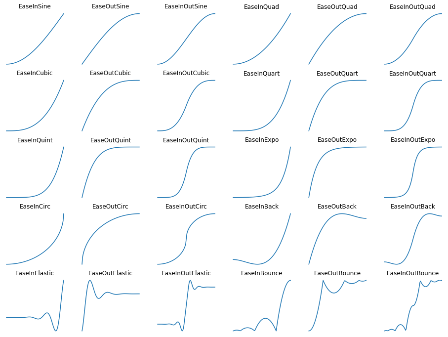

# Easing Functions In Python

Easing functions specify the rate of change of a parameter over time. This project simply implements the easing functions with Python and Numpy. Please check out "EasingFunctions.py" and "examples.ipynb" for more details. The following graph is to help developers to pick the right function.

